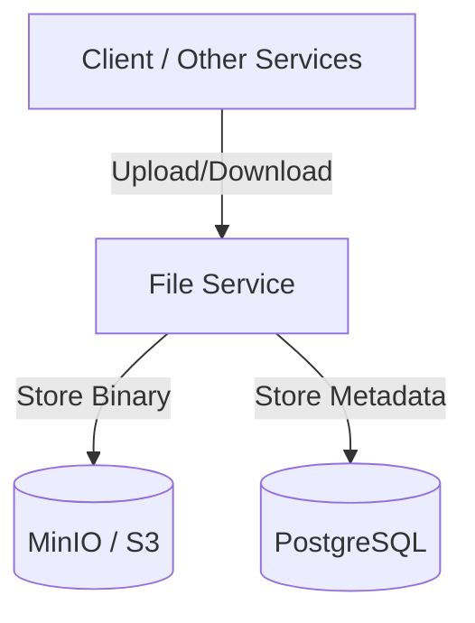

# File Service

## Description
The File Service provides an abstraction layer for file storage and management. it handles file uploads, downloads, and metadata storage, using MinIO for object storage and PostgreSQL for metadata.

## Architecture Diagram


## File Structure
```text
file-service/
├── k8s/                  # Kubernetes manifests
├── src/
│   ├── main/
│   │   ├── java/offeria/file_service/
│   │   │   ├── config/      # MinIO Configuration
│   │   │   ├── controller/  # Upload/Download REST endpoints
│   │   │   ├── dto/         # Request/Response data
│   │   │   ├── entity/      # Metadata entities
│   │   │   ├── exception/   # Custom exceptions
│   │   │   ├── mapper/      # Metadata mapping
│   │   │   ├── messaging/   # Common messaging logic
│   │   │   ├── repository/  # Metadata access layer
│   │   │   ├── service/     # Business logic & MinIO interaction
│   │   │   └── FileServiceApplication.java
│   │   └── resources/       # Configuration
│   └── test/                # Unit tests
├── Dockerfile           # Docker configuration
└── pom.xml              # Maven dependencies
```

## Technologies
- **Java 17**
- **Spring Boot 3**
- **MinIO Java SDK** (S3 Compatible)
- **Spring Data JPA**
- **PostgreSQL**
- **Maven**

## Key Dependencies
- `minio`: S3 compatible storage client.
- `spring-boot-starter-data-jpa`: File metadata persistence.
- `spring-cloud-starter-netflix-eureka-client`: Discovery client.

## Environment Variables
- `SPRING_PROFILES_ACTIVE`: Active profile.
- `EUREKA_CLIENT_SERVICEURL_DEFAULTZONE`: Discovery Service URL.
- `DB_URL`: JDBC URL for PostgreSQL.
- `DB_USERNAME`: PostgreSQL username.
- `DB_PASSWORD`: PostgreSQL password.
- `MINIO_ENDPOINT`: MinIO server URL.
- `MINIO_ACCESS_KEY`: Access key for MinIO.
- `MINIO_SECRET_KEY`: Secret key for MinIO.
- `MINIO_BUCKET_NAME`: Name of the bucket to store files.
